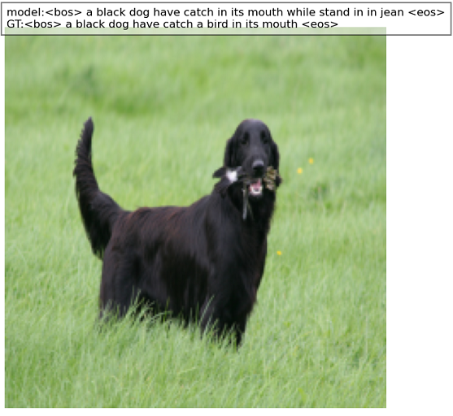
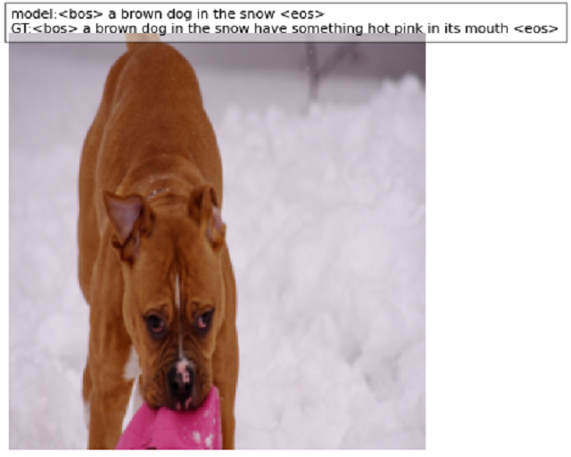

# My Image Captioning traind on Flickr 8k Dataset

I took flicker8k [dataset](https://www.kaggle.com/datasets/jainamshah17/flicker8k-image-captioning)  
I used the standard split on train and test suggested by the authors

## Examples  
### Train examples:  
    
### Test examples:  
    
*GT - ground truth - 1st image description

## Model 
I used nn.Transformer. Encoder extracted features from an image that is split into patches with positional encoding. And a decoder that returns the probability of the next token.

## Models  
I wrote 3 different models 
* ICT - the best model I wrote. (Alredy described in Model section)
* RT - I took resnet18 without the last two layers. Then I took the resulting resnet18 output representations and passed them to the transformer 
* CT - almost the same as RT, but without encoder. Only resnet18 without the last two layers and decoder which receives as input in cross attention the resulting resnet18 output representations

## Training
* The loss function was cross entropy loss
* I used LR 3e-5 until model dont reach >83 blue score(~100 epo) and then 3e-6 until model dont reach >0.91 bleu (~60 additional epochs) 

## Branches
On main branch i used only 1st image description and on all_descriptions i used all.
When i use all description i also calculated loss with all of them. It improved generalization ability. The model learned to produce general words about the image rather than specific words and structure. But it didn't give much of an increase in bleu score.

## Metrics
Bleu score below were calculated on the entire train and test dataset.  
But during training blue on the train dataset was calculated only on about 1000 examples to speed up and once in two epo
<table>
  <tr>
    <th>Set</th>
    <th>Bleu 1</th>
    <th>Bleu 2</th>
    <th>Bleu 3</th>
    <th>Bleu 4</th>
  </tr>
  <tr>
    <td>Train</td>
    <td>0.9166</td>
    <td>0.8874</td>
    <td>0.8737</td>
    <td>0.8606</td>
  </tr>
  <tr>
    <td>Test</td>
    <td>0.3445</td>
    <td>0.1018</td>
    <td>0.0163</td>
    <td>0.0058</td>
  </tr>
</table>

## How can it be improved ?
First, I was training on my rtx2060 6gb it imposed limitations and I couldn't for example just add more layers or smth like this.
* To improve model we can use pre trained encoder on image classification so that the model would extract better representations of given image. And also use decoder trained on next token prediction.
These encoder and decoder must have the same embedding size.  
For example ViT which has 16x16 patch size, 768 embedding size and 3072 feed-forward size is too big for my graphics card  
* A simple way to try to improve model is to increase embedding/layers/heads/batch size
* Another way to improve is to use larger dataset like COCO or Flickr 30k
* Use beam search 
* Another aspect of the model not directly related to the quality of the model is tokenizer improvement. Tokenizer that I wrote depends on the description file and when adding new previously not encountered words to this file or deleting all instance of an existing word can make the order of words and their tokens change and it follows that the weights from the model trained with another text file will not be suitable for corrective work i.e. we need to make the tokenizer independent from the file with descriptions